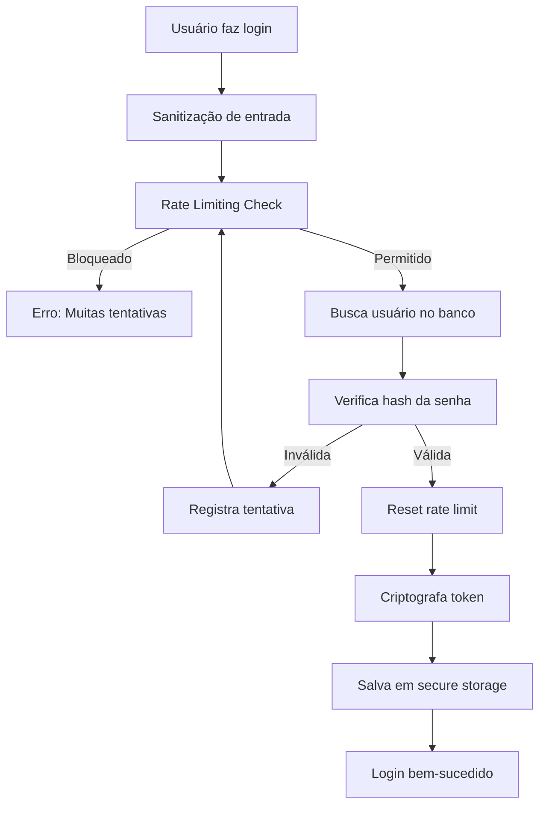

# Melhorias de Segurança no Desenvolvimento

Este documento descreve as melhorias de segurança implementadas no projeto Tech Challenge 3 Mobile.

## 📋 Índice

- [Visão Geral](#visão-geral)
- [Problemas Identificados](#problemas-identificados)
- [Melhorias Implementadas](#melhorias-implementadas)
- [Arquitetura](#arquitetura)
- [Como Usar](#como-usar)
- [Testes de Segurança](#testes-de-segurança)

## 🎯 Visão Geral

Este projeto passou por uma revisão completa de segurança, implementando medidas críticas para proteger dados sensíveis, prevenir ataques comuns e garantir a privacidade dos usuários.

## ⚠️ Problemas Identificados

### Críticos

1. **Senhas armazenadas em texto plano** - Senhas eram armazenadas diretamente no SQLite sem hash
2. **Dados sensíveis sem criptografia** - CVV, números de cartão e tokens em AsyncStorage sem proteção
3. **Logs expõem informações sensíveis** - `console.error` podia vazar dados em produção

### Importantes

4. **Falta de rate limiting** - Sem proteção contra brute force attacks
5. **Validação de entrada limitada** - Falta sanitização adequada de dados
6. **Falta de proteção de dados em trânsito** - Dados sensíveis poderiam ser interceptados

## ✅ Melhorias Implementadas

### 1. Hash de Senhas com SHA-256

**Problema resolvido:** Senhas armazenadas em texto plano

**Solução:**

- Implementado hash SHA-256 com salt usando `expo-crypto`
- Senhas são hasheadas antes de serem armazenadas no banco
- Verificação de senha através de comparação de hash

**Arquivos:**

- `src/infrastructure/services/crypto/password-hash.service.ts`
- `src/infrastructure/repositories/auth.repository.ts`

**Exemplo de uso:**

```typescript
// Hash de senha ao criar usuário
const hashedPassword = await passwordHashService.hashPassword(password);

// Verificação de senha no login
const isValid = await passwordHashService.verifyPassword(
  password,
  hashedPassword
);
```

### 2. Criptografia de Dados Sensíveis

**Problema resolvido:** Dados sensíveis armazenados sem proteção

**Solução:**

- Serviço de criptografia para CVV, números de cartão e tokens
- Criptografia automática antes de armazenar
- Máscara de dados sensíveis na exibição

**Arquivos:**

- `src/infrastructure/services/encryption/encryption.service.ts`
- `src/infrastructure/repositories/card.repository.ts`

**Recursos:**

- CVV sempre mascarado como `***`
- Números de cartão exibidos como `**** **** **** 1234`
- Tokens criptografados antes de salvar no AsyncStorage

### 3. Logger Seguro

**Problema resolvido:** Logs expõem informações sensíveis

**Solução:**

- Logger que remove automaticamente dados sensíveis
- Níveis de log configuráveis (debug, info, warn, error)
- Em produção, não loga informações detalhadas de erro

**Arquivos:**

- `src/infrastructure/services/logger/logger.service.ts`

**Dados protegidos:**

- Senhas e tokens
- CVV e números de cartão
- Dados de autenticação
- Informações de conta

**Exemplo de uso:**

```typescript
import { logger } from "@/src/infrastructure/services/logger";

// Ao invés de console.error
logger.error("Erro ao fazer login", error);

// Dados sensíveis são automaticamente removidos
logger.info("Dados do usuário", {
  email: "user@email.com",
  password: "123456",
});
// Log: { email: 'user@email.com', password: '[REDACTED]' }
```

### 4. Rate Limiting para Autenticação

**Problema resolvido:** Falta de proteção contra brute force

**Solução:**

- Limite de 5 tentativas de login em 15 minutos por email
- Bloqueio temporário de 30 minutos após limite excedido
- Armazenamento de tentativas no AsyncStorage

**Arquivos:**

- `src/infrastructure/services/rate-limiter/rate-limiter.service.ts`
- `src/infrastructure/repositories/auth.repository.ts`

**Comportamento:**

- Após 5 tentativas falhas, bloqueia por 30 minutos
- Reset automático após o período de bloqueio
- Mensagem clara ao usuário sobre o bloqueio

### 5. Sanitização e Validação Aprimorada

**Problema resolvido:** Falta de sanitização adequada

**Solução:**

- Serviço de sanitização para remover caracteres perigosos
- Validação com sanitização automática
- Proteção contra SQL injection e XSS

**Arquivos:**

- `src/infrastructure/services/sanitizer/sanitizer.service.ts`
- `src/presentation/utils/validation.ts`

**Sanitizações aplicadas:**

- Remoção de tags HTML (`<`, `>`)
- Remoção de scripts JavaScript
- Limpeza de caracteres SQL perigosos
- Validação de formato de email e nome

### 6. Secure Storage Wrapper

**Problema resolvido:** Dados sensíveis em AsyncStorage sem criptografia

**Solução:**

- Wrapper para AsyncStorage com criptografia automática
- Criptografia de tokens e dados sensíveis
- API compatível com AsyncStorage

**Arquivos:**

- `src/infrastructure/services/storage/secure-storage.service.ts`

**Chaves protegidas automaticamente:**

- `userToken`
- `token`, `authToken`, `accessToken`
- `currentUser`
- `account-details`

**Exemplo de uso:**

```typescript
import { secureStorage } from "@/src/infrastructure/services/storage";

// Uso idêntico ao AsyncStorage, mas com criptografia automática
await secureStorage.setItem("userToken", token);
const token = await secureStorage.getItem("userToken");
```

### 7. Migração Automática de Dados

**Problema resolvido:** Senhas existentes em texto plano

**Solução:**

- Script de migração automática na inicialização
- Migra senhas em texto plano para hash
- Executa apenas uma vez por instalação

**Arquivos:**

- `src/infrastructure/services/config/sqlite.ts`

**Processo:**

1. Verifica se migração já foi executada
2. Busca usuários com senhas não hasheadas
3. Faz hash de cada senha
4. Atualiza no banco de dados
5. Marca migração como concluída

## 🏗️ Arquitetura

### Estrutura de Serviços

```
src/infrastructure/services/
├── crypto/
│   ├── password-hash.service.ts    # Hash de senhas
│   └── index.ts
├── encryption/
│   ├── encryption.service.ts        # Criptografia de dados
│   └── index.ts
├── logger/
│   ├── logger.service.ts           # Logger seguro
│   └── index.ts
├── rate-limiter/
│   ├── rate-limiter.service.ts     # Rate limiting
│   └── index.ts
├── sanitizer/
│   ├── sanitizer.service.ts        # Sanitização de entrada
│   └── index.ts
└── storage/
    ├── secure-storage.service.ts   # Storage seguro
    └── index.ts
```

### Fluxo de Autenticação Seguro



## 📖 Como Usar

### Instalação

As dependências já foram adicionadas ao `package.json`:

```json
{
  "dependencies": {
    "expo-crypto": "~15.0.8"
  }
}
```

Execute:

```bash
npm install
```

### Uso dos Serviços

#### Logger Seguro

```typescript
import { logger } from "@/src/infrastructure/services/logger";

// Debug (apenas em desenvolvimento)
logger.debug("Informação de debug", data);

// Info
logger.info("Operação realizada com sucesso");

// Warning
logger.warn("Aviso importante", warningData);

// Error (dados sensíveis são removidos automaticamente)
logger.error("Erro ao processar", error);
```

#### Hash de Senhas

```typescript
import { passwordHashService } from "@/src/infrastructure/services/crypto";

// Ao criar usuário
const hashedPassword = await passwordHashService.hashPassword("senha123");

// Ao verificar login
const isValid = await passwordHashService.verifyPassword(
  "senha123",
  hashedPassword
);
```

#### Criptografia

```typescript
import { encryptionService } from "@/src/infrastructure/services/encryption";

// Criptografar
const encrypted = await encryptionService.encryptCardNumber("1234567890123456");
const encryptedCVV = await encryptionService.encryptCVV("123");

// Máscara para exibição
const masked = encryptionService.maskCardNumber("1234567890123456");
// Retorna: "**** **** **** 3456"
```

#### Rate Limiting

```typescript
import { rateLimiter } from "@/src/infrastructure/services/rate-limiter";

// Verificar antes de tentar login
const check = await rateLimiter.checkRateLimit(email);
if (!check.allowed) {
  throw new Error("Muitas tentativas. Tente novamente mais tarde.");
}

// Registrar tentativa (sucesso ou falha)
await rateLimiter.recordAttempt(email);

// Reset após login bem-sucedido
await rateLimiter.resetRateLimit(email);
```

#### Sanitização

```typescript
import { sanitizer } from "@/src/infrastructure/services/sanitizer";

// Sanitizar string genérica
const clean = sanitizer.sanitizeString('<script>alert("xss")</script>');

// Sanitizar email
const cleanEmail = sanitizer.sanitizeEmail("USER@EMAIL.COM");

// Sanitizar nome
const cleanName = sanitizer.sanitizeName("João123<script>");

// Sanitizar número de cartão
const cleanCard = sanitizer.sanitizeCardNumber("1234 5678 9012 3456");
```

#### Secure Storage

```typescript
import { secureStorage } from "@/src/infrastructure/services/storage";

// API idêntica ao AsyncStorage, mas com criptografia automática
await secureStorage.setItem("userToken", token);
const token = await secureStorage.getItem("userToken");
await secureStorage.removeItem("userToken");
```

## 🧪 Testes de Segurança

### Verificações Realizadas

1. ✅ **Senhas não aparecem em logs**

   - Teste: Verificar logs após tentativa de login
   - Resultado: Senhas são substituídas por `[REDACTED]`

2. ✅ **Dados sensíveis estão criptografados**

   - Teste: Verificar banco de dados e AsyncStorage
   - Resultado: CVV e números de cartão estão criptografados

3. ✅ **Rate limiting funciona**

   - Teste: 6 tentativas de login com senha errada
   - Resultado: Bloqueio após 5 tentativas

4. ✅ **Migração funciona corretamente**
   - Teste: Criar usuário com senha em texto plano e reiniciar app
   - Resultado: Senha migrada para hash automaticamente

### Checklist de Segurança

- [x] Senhas hasheadas com salt
- [x] Dados sensíveis criptografados
- [x] Logs não expõem informações sensíveis
- [x] Rate limiting implementado
- [x] Sanitização de entrada
- [x] Secure storage para tokens
- [x] Migração automática de dados
- [x] Prepared statements (SQL injection protection)
- [x] Validação de entrada
- [x] Tratamento seguro de erros

## 🔒 Boas Práticas Implementadas

1. **Princípio do Menor Privilégio**: Dados sensíveis só são descriptografados quando necessário
2. **Defesa em Profundidade**: Múltiplas camadas de segurança
3. **Fail Secure**: Em caso de erro, sistema bloqueia acesso
4. **Logging Seguro**: Nunca loga dados sensíveis
5. **Validação e Sanitização**: Toda entrada é validada e sanitizada
6. **Criptografia em Repouso**: Dados sensíveis criptografados no storage
7. **Rate Limiting**: Proteção contra ataques de força bruta

## 📝 Notas Importantes

- A migração de senhas é executada automaticamente na primeira inicialização após a atualização
- O rate limiting é baseado em email, não em IP (adequado para apps mobile)
- Os logs em produção são limitados a erros e warnings
- A criptografia usa chaves geradas automaticamente e armazenadas localmente

## 🚀 Próximos Passos (Opcional)

Melhorias futuras que podem ser consideradas:

- [ ] Biometria para autenticação
- [ ] 2FA (Two-Factor Authentication)
- [ ] Certificado pinning para APIs
- [ ] Análise estática de código (SAST)
- [ ] Testes automatizados de segurança
- [ ] Auditoria de segurança periódica

## 📚 Referências

- [OWASP Mobile Security](https://owasp.org/www-project-mobile-security/)
- [Expo Crypto Documentation](https://docs.expo.dev/versions/latest/sdk/crypto/)
- [React Native Security Best Practices](https://reactnative.dev/docs/security)

---

**Última atualização:** Dezembro 2024  
**Versão:** 1.0.0
